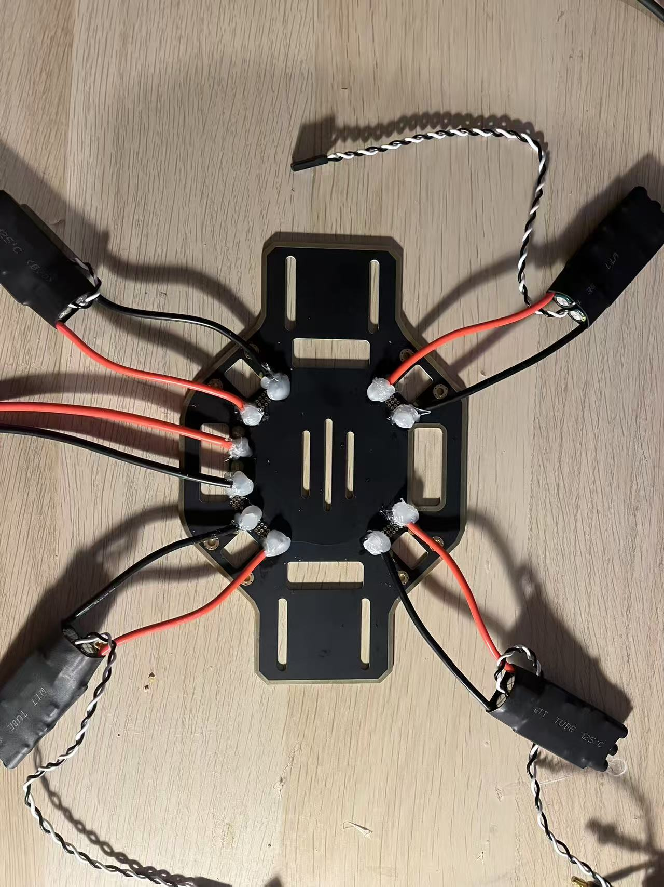
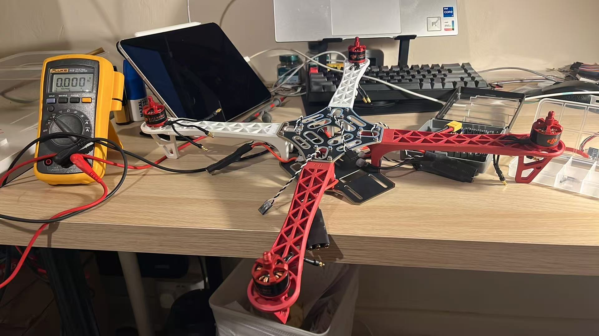
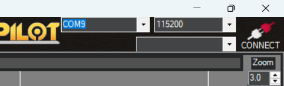
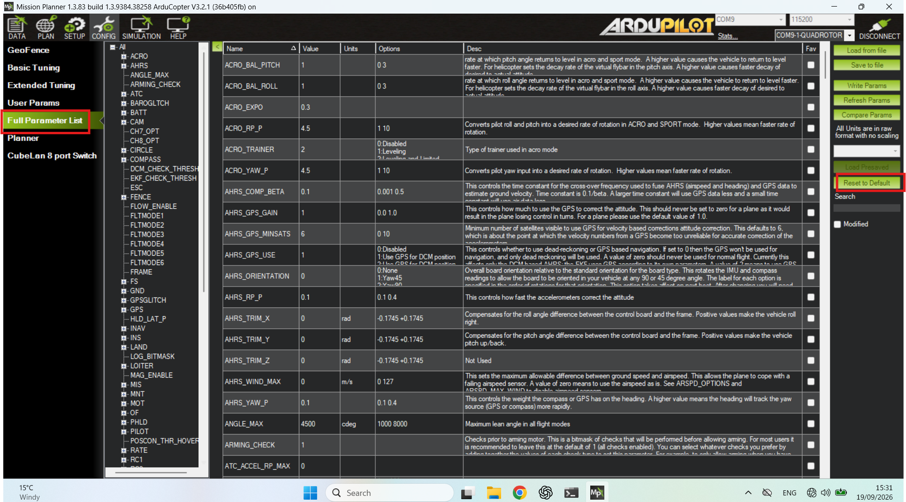
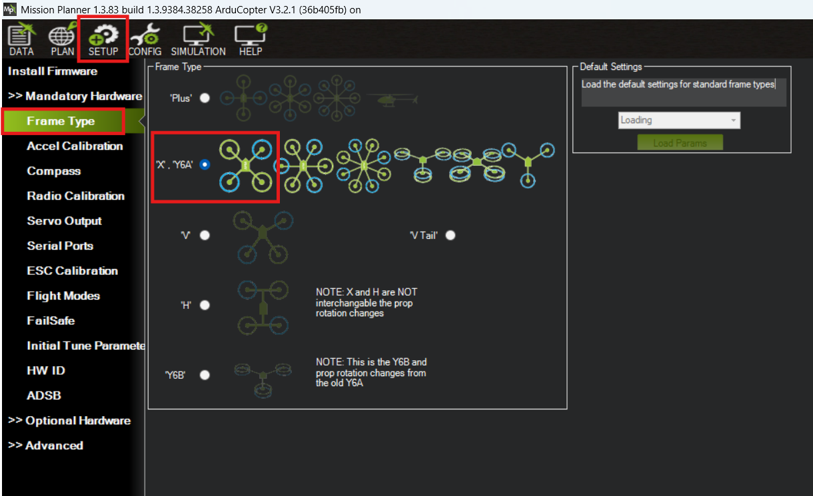
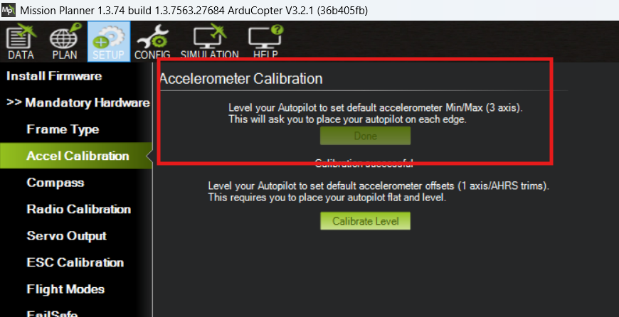
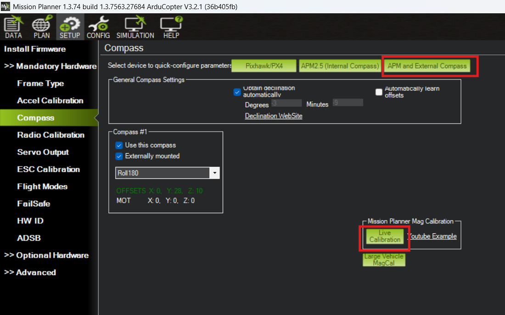
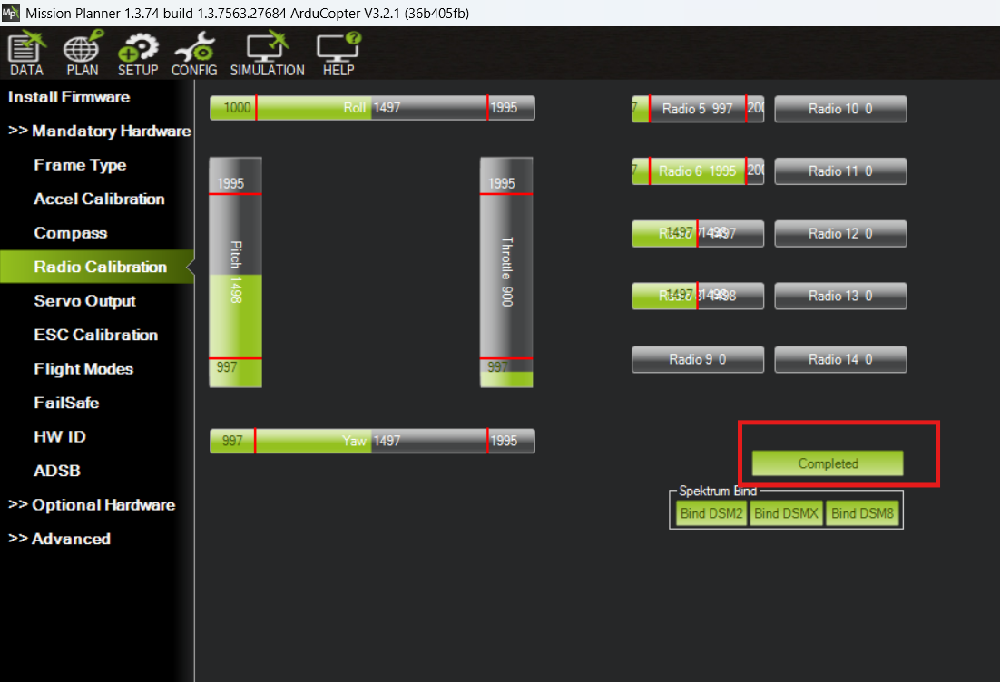
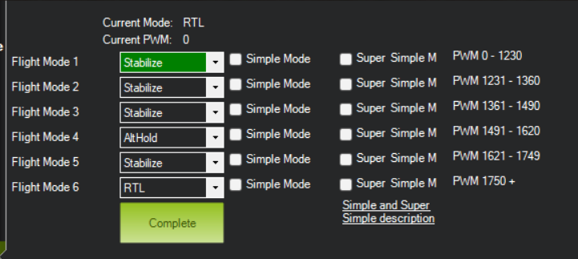
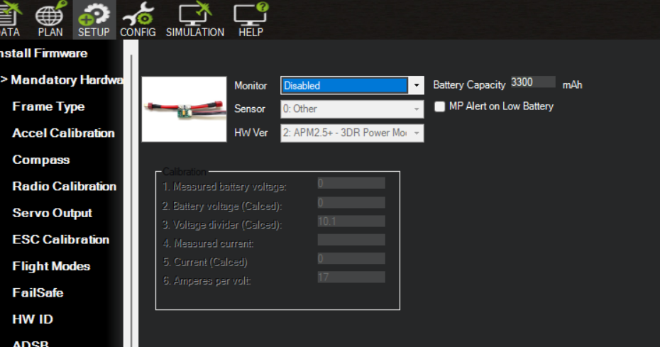

# Quadcoater Drone

## Introduction

This is a Quadcoater Drone project.

## Hardware equipment

- F450 Framework
- Turnigy Liop Battery 3S
- SKYRC LiPro Balance Charger
- AMP 2.8.0 Fly Controller
- FS-i6 Fly remote controller
- DJI 2212/920KV brushless motor and ESC *4
- GPS module 
- Battery voltage module

## Supporting equipment
- Multimeter
- Soldering tools
- Screwdriver
- Hot glue gun
- Cable tie
- 

## Soldering the Battery and ESC

Before we start this project, we need soldering the the battery line and the
ESC line to the bottom board of the F450 frame. The after soldering picture is shown below:

  

Be Careful soldering each line in a correct pad. This F450 board has the + and - label to make sure it. After that, use the multimeter to test them.

After that, connect the battery to battery line and connect the ESC and brushless motor. It is shown below:

  

At this moment, the Motor will have some noise. BBBBBB...

It is normal, since the noise means the power is okay and we PWM signal input. We make sure the battery connectiong is finished well.

We can use the hot glue gun to cover the exposed solder joint we make sure it is safe and enhance the connection. This step may not essential. The picture is shown below:

  

After that, we can test it with multimeter again and contribute the frame.

  

## Mission Planner

The software download link is: [Mission Planner](https://ardupilot.org/planner/docs/mission-planner-installation.html)

First, connect the Fly controller and PC via Data cable. Choose the port number and bit rate.

  

Config - Full parameter list - Reset to default

  

And reconnect the AMP and go to the SETUP setting

  

Finish the Accel_Calibration. But for the old version AMP2.8.0 the last version Mission planner 
cannot do this step. Thus, I download the 1.3.74 version for this project. Follow the step and finish it.

  

Compass Calibration for the GPS module.

  

Radio Calibration. In this step, move the transmitter sticks through their full range of motion.

  

Set the the SWc switch for Channel 5 in transmitter.

Set the flight mode.

  

Set the battery setting.

  

